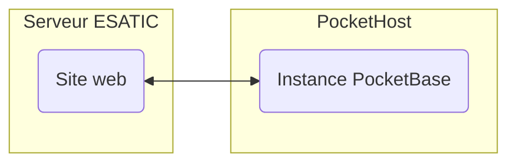

# CID

Bienvenue sur le dépôt du site web de la CID. Le site est développé en utilisant le
framework [Nuxt.js](https://nuxt.com/) et [PocketBase](https://pocketbase.io/) (Nous
utilisons [PocketHost](https://pockethost.io/) pour l'hébergement de
notre [instance PocketBase](https://cid.pockethost.io/_/)).

**Architecture :**



**Structure du projet :**

- `.vscode/` : Configuration [Visual Studio Code](https://code.visualstudio.com/)
- `pocketbase/` : Dockerfile et données de PocketBase (les données sont ignorées par git)
- `.gitignore` : Fichiers ignorés par git
- `README.md` : Ce fichier

Pour les autres dossiers, voir la [documentation de Nuxt](https://nuxt.com/docs/guide/directory-structure/app).

## Installation

Avant de commencer, assurez-vous d'avoir installé [Docker](https://www.docker.com/).

### PocketBase

PocketBase est un backend open source basé sur une base de données SQLite. Il intègre l'authentification des
utilisateurs, un tableau de bord et d'une API REST simple.

Si vous avez une sauvegarde de PocketBase, vous pouvez la restaurer en copiant le dossier `pb_data` dans le
dossier `pocketbase/pb_data`.

Depuis la racine du projet :

```bash
# Construire l'image
docker build -t pocketbase pocketbase --build-arg PB_VERSION=0.16.3
# Démarrer le conteneur
docker run -d --name pocketbase -p 8080:8080 -v $PWD/pocketbase/pb_data:/pb_data pocketbase serve --debug --http=0.0.0.0:8080 --dir=/pb_data
```

PocketBase est maintenant accessible à [cette adresse](http://localhost:8080/_). Pour plus d'informations, voir
la [documentation de PocketBase](https://pocketbase.io/docs/).

### Applications

Depuis la racine du projet :

```bash
yarn # Installer les dépendances
yarn dev # Démarrer le serveur de développement
```

## Déploiement

```bash
yarn build # Si vous avez un serveur avec Node.js
yarn generate # Pour les hébergements statiques (ex: Apache, Nginx, etc.)
```

Les applications sont construites dans le dossier `.output/`. Vous pouvez ensuite les déployer sur votre serveur. Pour
plus d'informations, voir la [documentation de Nuxt](https://nuxt.com/docs/getting-started/deployment).

## Contribuer

Les contributions sont les bienvenues ! Veuillez vous référer
au [guide GitHub](https://docs.github.com/fr/get-started/exploring-projects-on-github/contributing-to-a-project) pour
plus d'informations.

## Crédits

Développé par [Soumaila Géoffroy Evane](https://sovmulax.me/), [N'Guessan Alex Marc-Aurel](https://marcaureln.com)
et [Konan Kouame Aimé Fabrice](https://konankouameaimefabrice.000webhostapp.com/index.php).
