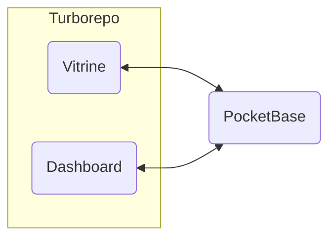

# CID

Bienvenue sur le dépôt du site web de la CID. Le site est développé en utilisant le framework [Nuxt.js](https://nuxt.com/), [Turborepo](https://turbo.build/repo) et [PocketBase](https://pocketbase.io/) (Nous utilisons [PocketHost](https://pockethost.io/) pour l'hébergement de notre [instance PocketBase](https://cid.pockethost.io/_)).

**Architecture :**



**Structure du projet :**

- `.vscode/` : Configuration [Visual Studio Code](https://code.visualstudio.com/)
- `apps/` : Applications
  - `admin/` : Dashboard
  - `web/` : Vitrine
- `pocketbase/` : Dockerfile et données de PocketBase (les données sont ignorées par git)
- `.gitignore` : Fichiers ignorés par git
- `.prettierrc` : Configuration [Prettier](https://prettier.io/)
- `package.json` : Dépendances du projet. Le projet utilise [Yarn](https://yarnpkg.com/) comme gestionnaire de paquets. La version de Node.js et Yarn est spécifiée dans ce fichier (voir `volta`).
- `README.md` : Ce fichier
- `turbo.json` : Configuration [Turborepo](https://turbo.build/repo)
- `yarn.lock` : Verrouillage des dépendances.


## Installation

Avant de commencer, assurez-vous d'avoir installé [Docker](https://www.docker.com/).

### PocketBase

PocketBase est un backend open source basé sur une base de données SQLite. Il intègre l'authentification des utilisateurs, un tableau de bord et d'une API REST simple.

Si vous avez une sauvegarde de PocketBase, vous pouvez la restaurer en copiant le dossier `pb_data` dans le dossier `pocketbase/pb_data`.

Depuis la racine du projet :

```bash
# Construire l'image
docker build -t pocketbase pocketbase --build-arg PB_VERSION=0.16.3
# Démarrer le conteneur
docker run -d --name pocketbase -p 8080:8080 -v $PWD/pocketbase/pb_data:/pb_data pocketbase serve --debug --http=0.0.0.0:8080 --dir=/pb_data
```

PocketBase est maintenant accessible à l'adresse http://localhost:8080/_. Pour plus d'informations, voir la [documentation de PocketBase](https://pocketbase.io/docs/).

### Applications

Depuis la racine du projet :

```bash
# Installer les dépendances
yarn install
# Démarrer les applications
yarn dev
# Vous pouvez aussi démarrer les applications individuellement
yarn dev:web # Démarrer la vitrine
yarn dev:admin # Démarrer le dashboard
```

La vitrine est maintenant accessible à l'adresse http://localhost:3000/ et le dashboard à l'adresse http://localhost:3001/.

## Déploiement

Turborepo vous permet de construire les applications en une seule commande :

```bash
yarn build
```

Les applications sont construites dans le dossier `.output/` de chaque application (ex: `apps/web/.output/`). Vous pouvez ensuite les déployer sur votre serveur. Pour plus d'informations, voir la [documentation de Nuxt](https://nuxt.com/docs/getting-started/deployment)

## Crédits

Développé par [Soumaila Géoffroy Evane](https://sovmulax.me/), [N'Guessan Alex Marc-Aurel](https://marcaureln.com) et [Konan Kouame Aimé Fabrice](https://konankouameaimefabrice.000webhostapp.com/index.php).
